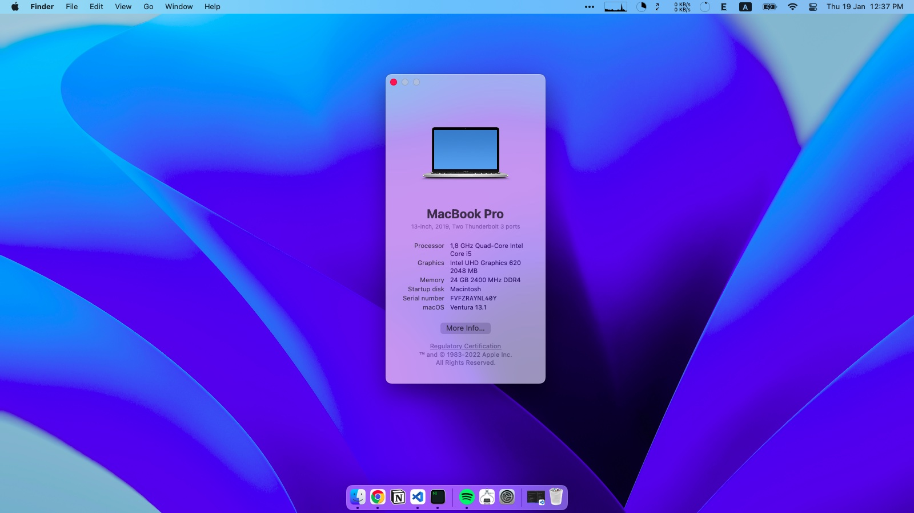

|  |  |
| --------------------------- | ---------------------- |

# Info
This repo contains files needed to "Hackintosh" your Lenovo T490, model number 20NL-000LFR (Core i5, 8GB RAM)

+ MacOS:     Ventura 13.1
+ OpenCore:  0.8.5
### Hardware 

| Name     | Model                            |
| -------- | -------------------------------- |
| CPU      | Intel Core i5-8265U              |
| GPU      | Intel UHD Graphics 620           |
| RAM      | 8GB RAM DDR4 2400 Mhz            |
| SSD      | 512GB SAMSUNG MZVLB512HBJQ-000L7 |
| Wifi     | Intel Wireless AC-9560           |
| Screen   | 13" FHD                          |
| Touchpad | Synaptics                        |
| Display  | 14" 1920x1080 IPS Non-Touch      |

### Status

- [x] CPU power management
- [x] Shutdown, restart, sleep
- [x] Internal speaker and internal mic, xxternal audio
- [x] Trackpad (with gesture)
- [x] HDMI output
- [x] HDMI audio
- [x] Battery indicator
- [x] Brightness
- [x] Brightness keys
- [x] Ethernet
- [x] Wifi
- [x] Bluetooth
- [x] All USB Ports
- [ ] SD card  
- [ ] Thunderbold port  

# Usage

+ Read carefully the [OpenCore documentation](https://dortania.github.io/OpenCore-Install-Guide/prerequisites.html#prerequisites).

+ Download the latest release of [EFI folder] and copy it to the EFI folder of your USB drive.

+ Change `MLB`, `SystemSerialNumber`, `SystemUUID`, etc in `config.plist` to your own values. You can generate them using [GenSMBIOS](https://github.com/corpnewt/GenSMBIOS/tree/8ecef0485c9e0e540b709f2573ae0ff2b7a250a2).

# Credits

+ [OpenCore](https://dortania.github.io/OpenCore-Install-Guide/)
+ [ZoR3oL](https://github.com/ZoR3oL) for the [t490-hackintosh](https://github.com/ZoR3oL/t490-hackintosh) repo.
+ [@yangjingren](https://twitter.com/yangjingren/status/1459141341779087367) for the beautiful Opencore theme.
